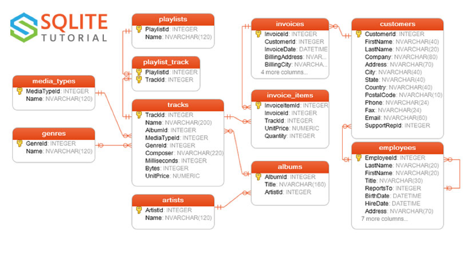

# Access and Expose a Database (full-stack)

This project was an assignment with the end-goal being a deployed Spring application in Heroku.

## Background

For this assignment we were required to make an app using Spring Boot in Java. This connected to a sqlite mock database 
containing customer music tracks purchases information. We had to use plain java to create a Spring Boot Web API and use 
Thymeleaf to create a view and finally to create an image of the application through Docker after which to publish it on Heroku.

Link database:
https://github.com/lerocha/chinook-database/raw/master/ChinookDatabase/DataSources/Chinook_Sqlite.sqlite

Link ERDs: https://www.sqlitetutorial.net/sqlite-sample-database/

For the first part of the assignment (not part of the Thymeleaf view) we had created an API layer for the following:
1. Read all the customers in the database, this should display their: Id, first name, last name, country, postal code, phone number and email.
2. Read a specific customer from the database (by Id), should display everything listed in the above point.
3. Read a specific customer by name. HINT: LIKE keyword can help for partial matches.
4. Return a page of customers from the database. This should take in limit and offset as parameters and make use
   of the SQL keywords to get a subset of the customer data. The customer model from above should be reused.
   i.e. 10 customers starting at 50 (customers 50-60).
5. Add a new customer to the database. You also need to add only the fields listed above (our customer object)
6. Update an existing customer.
7. Return the number of customers in each country, ordered descending (high to low). i.e. USA: 13, ...
8. Customers who are the highest spenders (total in invoice table is the largest), ordered descending.
9. For a given customer, their most popular genre (in the case of a tie, display both). Most popular in this context
   means the genre that corresponds to the most tracks from invoices associated to that customer.

For 9th requirement we took the query from our colleagues Richie and Savannah.
https://github.com/savannah-borst/Assignment_Database

For the second part of the assignment concerned the Thymeleaf application containing the following:

1. The home page view, showing the 5 random artists, 5 random songs, and 5 random genres. This home page contains a 
search bar which is used to search for tracks. The search bar should not be empty, meaning you can’t have an empty search criterion.

2. The search results page will show the query the user has made, i.e. Search results for “Never gonna give you up”.
Underneath this, the results will be shown for the search. The search results should show a row where the track name, artist,
album, and genre are shown. The search should also be case insensitive.

We have also tested REST endpoints API calls using Postman, a JSON file can be found in the folder resources.

#Credits 

- Iljaas Dhonre
- Mohammed El Maghawry

#Licence 
[MIT](https://choosealicense.com/licenses/mit/)

